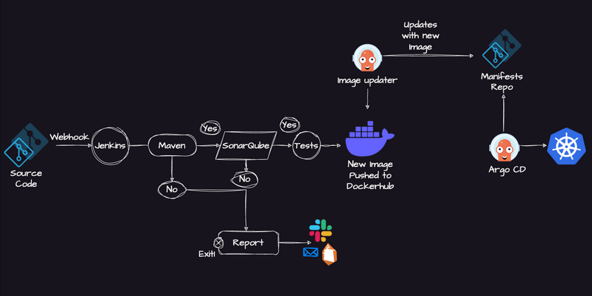

# Ultimate-CICD-Jenkins
Complete CI/CD pipeline for a Java application, using Maven, SonarQube, Argo CD, Docker and Kubernetes

CI stands for Continuous Integration and CD stands for Continuous Delivery/Deployment. It is the process of automating the integration of code changes from different sources to a single codebase and testing if it is deployable, followed by deploying for the end-users.

Here's the detailed explanation of the entire pipeline:
Step 1 -
Checking out the code from SCM, it is this repo in my project

Step 2 -
Either configure GitHub webhooks or directly provide this repo as the script path in Jenkins for triggering the Jenkins pipeline to begin the process to automatic building and testing.

Step 3 -
Use Maven targets i.e., maven clean package to build the java application on the Docker image chosen as agent(complete pipeline is executed on this Docker Image). But don't have to install since Maven is pre-installed on the Docker Image.

Step 4 -
Now, install SonarQube to perform static code ananlysis, code scanning and checking for vulnerabilities. If any of the tests failed, configure Jenkins plug-ins to send out alerts/notifications.

Step 5 -
If the previous stage is passed, build the Docker Image of this applicationa and push the image to any docker regisrtries like DockerHub, ECR etc.

------------------This marks the end of Continuous Integration--------------------------

Step 6 -
Now that we have the final image in the registry, we need to monitor it constantly for changes and this can be done using a shell-script or Argo Image Updator. I have used a shell-script here. Ansible, which is a configuration management tool can be used too, but it doesn't have the ability to constantly monitor.

Step 7 -
Whenever there is a change in the image in the registry, the shell-script catches it and updates the manifests repository, which is deployment.yml in this project. This new commit made to this manifests repo, keeps the image updated.

Step 8 -
Here comes the main character of our pipeline i.e., Argo CD. It is responsible for maintaining state between the manifests folder and the kubernetes cluster on which the application is deployed. Argo CD uses the manifests as the single source of truth and enables proper deployment of the application and maintentance of the kubernetes cluster-infrastructure.

Step 9 -
Finally, Argo CD deploys the application on to the kubernetes cluster and application will be running on 2 pods as specified in deployment.yml

java-app-cicd/README.md at main · RachanaVenkat/java-app-cicd